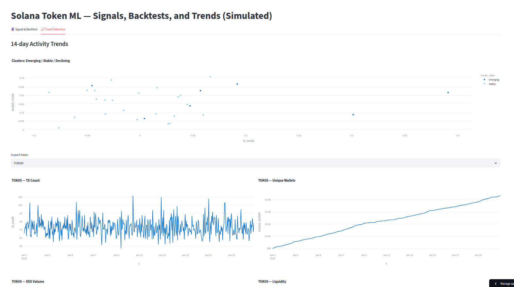

# Solana Token ML Dashboard (Simulated)

An interactive Streamlit app that **simulates on-chain Solana token data**, engineers features, trains a lightweight ML model, and runs a simple backtest. It also clusters tokens into **Emerging / Stable / Declining** based on recent activity trends.

> ⚠️ Uses **synthetic** data (NDA-safe). Designed to mimic on-chain dynamics (volume/whales/liquidity spikes) so the ML model has real signal to learn.

---

## ✨ Features
- **Synthetic Data Simulation** – 30 tokens, hourly bars, random activity & price/liq spikes.
- **Feature Engineering** – returns, rolling volatility, EMA ratios, z-scores (volume/tx/whales), liquidity change.
- **ML Model** – Gradient Boosting Classifier predicting next-hour up moves.
- **Backtesting** – TP/SL/timed exits with simple fee assumptions; equity curve + trade log.
- **Trend Detection** – 14-day clustering into Emerging / Stable / Declining from activity trends.
- **Interactive UI** – token price with signal markers; tweak TP/SL/H & threshold live.

---

## 🖥 Live App
Launch in your browser:  
**https://solana-ml-dashboard-kjxms2o9ep4t5udjuffys9.streamlit.app/**

---

## 📷 Screenshot

